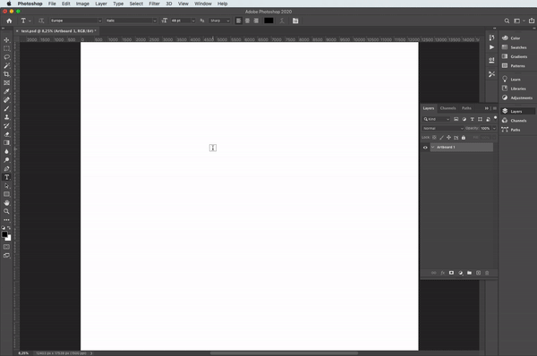

### Transform a straight line into a 'diagonal' by offsetting every character on a new line

#### Demo

#### How to use
[How to run Adobe scripts](https://medium.com/photoshop-tips/how-to-run-script-465d45031de6) An excellent article on various methods to do so

##### Get Started
1. Open Photoshop open and **select the desired text layer** to be transformed.
2. Select File > Scripts > Browse and navigate to the ‘Scriptname.jsx’ file.

OR 

2. Change the ‘Scriptname.jsx’ file using “Open with” -> Photoshop. Now you can execute the script by double-clicking on the file.

